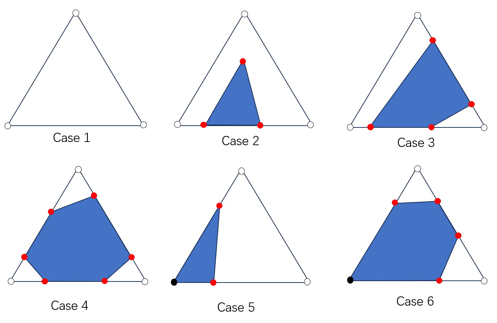
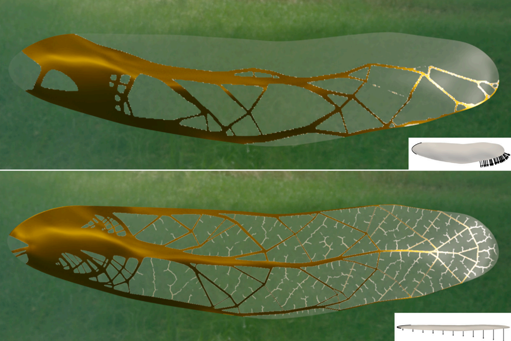
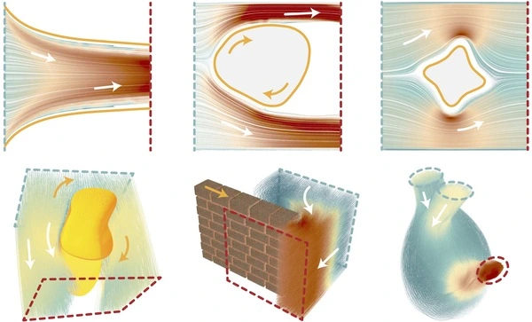

# MESO Modern GPU Fluid Simulator

[Mengdi Wang](https://wang-mengdi.github.io/), [Yuchen Sun](https://yuchen-sun-cg.github.io/), [Yitong Deng](https://yitongdeng.github.io/), [Fan Feng](https://sking8.github.io/)

**MESO** is a high-performance GPU fluid simulator developed by [Prof. Bo Zhu's Lab](https://faculty.cc.gatech.edu/~bozhu/) at Georgia Tech. Built entirely in modern **C++ and CUDA**, MESO is designed for advanced research and scalable simulation of physically-based phenomena, including fluids, particles, and hybrid systems.

## Features

- **Modern C++ Architecture**  
  Clean, modular design using modern C++ features for ease of use and customization.

- **High-Performance GPU Backend**  
  Custom CUDA kernels enable efficient large-scale simulations, with significantly lower overhead than Python-based frameworks.

- **Grid-Based Fluids with DEC Operators**  
  Built on discrete exterior calculus (DEC), allowing flexible construction of differential operators directly from mathematical definitions.

- **Multi-Physics Support**  
  Includes incompressible fluid solvers, free-surface fluid, particle systems, and hybrid methods.

- **Optimized Poisson Solver**  
  A finely tuned GPU Poisson solver for fast pressure projection and large system solves.

#### Performance (Test on Nvidia RTX 4080)

We evaluate the time cost of our MGPCG Poisson solver under various boundary conditions. Additionally, we record the number of CG iterations required to reach a convergence tolerance of 1e-5. 

|                             | 128^3           | 256^3            | 512^3             |
| --------------------------- | --------------- | ---------------- | ----------------- |
| Dirichlet                   | 25 ms, 5 iters  | 112 ms, 5 iters  | 757 ms, 5 iters   |
| Neumann                     | 41 ms, 9 iters  | 244 ms, 13 iters | 2411 ms, 18 iters |
| Mixed Dirichlet and Neumann | 71 ms, 17 iters | 451 ms, 24 iters | 4750 ms, 35 iters |

## Why MESO?

MESO is designed for simulation researchers and developers who need full control over numerical methods, efficient GPU execution, and mathematical expressiveness. Whether you're building new solvers, testing physical models, or optimizing for performance, MESO provides a robust and customizable foundation.

## Supported Papers

#### [An interface tracking method with triangle edge cuts](https://wang-mengdi.github.io/proj/triangle-edge-cuts)

  
[Mengdi Wang](https://wang-mengdi.github.io/), [Matthew Cong](https://physbam.stanford.edu/~mdcong/), [Bo Zhu](https://faculty.cc.gatech.edu/~bozhu/)  
*Journal of Computational Physics (Volume 520, 1 January 2025, 113504)*  

---

#### [Nonlinear topology optimization on thin shells using a reduced-order elastic shell model](https://shiyingxiong.github.io/proj/ThinShell/ThinShell.pdf)
  
[Fan Feng](https://sking8.github.io/), [Shiying Xiong](https://shiyingxiong.github.io/), Hiroki Kobayashi, Yuqing Zhou, Masato Tanaka, Atsushi Kawamoto, Tsuyoshi Nomura, [Bo Zhu](https://faculty.cc.gatech.edu/~bozhu/)  
*Thin-Walled Structures, 197, 111566, 2024*

---

#### [NeuralFluid: Neural Fluidic System Design and Control with Differentiable Simulation](https://people.csail.mit.edu/liyifei/publication/neuralfluid/)

  
[Yifei Li](https://people.csail.mit.edu/liyifei/), [Yuchen Sun](https://yuchen-sun-cg.github.io/), [Pingchuan Ma](https://pingchuan.ma/), [Eftychios Sifakis](https://pages.cs.wisc.edu/~sifakis/), [Tao Du](https://people.iiis.tsinghua.edu.cn/~taodu/), [Bo Zhu](https://cs.dartmouth.edu/~bozhu/), [Wojciech Matusik](https://cdfg.csail.mit.edu/wojciech)  
*Neural Information Processing Systems (NeurIPS 2024).*  

---

## Getting started

##### Install Environment
- The newest version of [`xmake`](https://xmake.io/#/) build tool.
- CUDA >= 11.6
- [Optional] Visual Studio 2022 (with the "Desktop development with C++" workload)

##### Run Tests

      $ python run_tests.py

You should pass all tests.

##### Option 1: Build with Visual Studio

      $ python make_project.py fluid_euler

Open `\build\fluid_euler\vsxmake2022\fluid_euler.sln` and compile in Release mode.
Navigate to `\bin\fluid_euler\windows\x64\release` and copy `docs\fluid_euler\cavity.json`  to the current folder. Run:

      $ fluid_euler.exe cavity.json

An output folder named `cavity` with `.vst` files will be generated.

##### Option 2: Build with xmake

      $ python build_project.py fluid_euler

And run the executable file similarly.

##### Visualize Results with Paraview
- Open Paraview
- Navigate to the folder containing `.vst` files and open the files.
- Click on the eye symbol to show the results.
- Suggestions on modifying settings:
  -  Coloring: velocity
  - Right click on the file to add filter (for example `glyph`)
  - Orientation array: velocity
  - Masking: all points (continous display of points)
  - Click `apply` to save the settings
- Click &rarr; in the toolbar at top of screen to play the animation.
- `ctrl+s` to save the result.

## Code Structure

Maintainers:

- Kernel, grid_algorithm, dec_system: Mengdi Wang
- particle_algorithm: Yitong Deng
- mesh_algorithm: Fan Feng