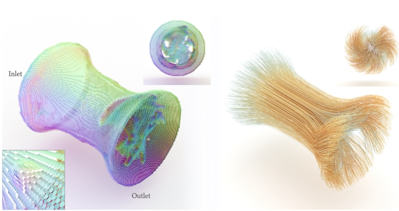

# MESO Modern GPU Fluid Simulator

[Mengdi Wang](https://wang-mengdi.github.io/), [Yuchen Sun](https://yuchen-sun-cg.github.io/), [Yitong Deng](https://yitongdeng.github.io/), [Fan Feng](https://sking8.github.io/)

MESO is a GPU fluid simulator developed by [Prof. Bo Zhu's Lab](https://faculty.cc.gatech.edu/~bozhu/). It supported the following papers:

[**An interface tracking method with triangle edge cuts**](https://wang-mengdi.github.io/proj/triangle-edge-cuts)
 

 
[**Mengdi Wang**](./), [Matthew Cong](https://physbam.stanford.edu/~mdcong/), [Bo Zhu](https://faculty.cc.gatech.edu/~bozhu/)  
 
Journal of Computational Physics (Volume 520, 1 January 2025, 113504)

[**Fluidic Topology Optimization with an Anisotropic Mixture Model
**](https://people.csail.mit.edu/liyifei/publication/anisotropicstokes)
 

 
[Yifei Li](https://people.csail.mit.edu/liyifei/), [Tao Du](https://people.iiis.tsinghua.edu.cn/~taodu/), [Sangeetha Grama Srinivasan](https://sanggs.github.io/), [Kui Wu](https://people.csail.mit.edu/kuiwu/), [Bo Zhu](https://faculty.cc.gatech.edu/~bozhu), [Eftychios Sifakis](https://pages.cs.wisc.edu/~sifakis/), and [Wojciech Matusik](https://cdfg.csail.mit.edu/wojciech)
 
ACM Transactions on Graphics (SIGGRAPH Asia 2022), Volume 41, Issue 6.

## Getting started

##### Install Environment
- The newest version of [`xmake`](https://xmake.io/#/) build tool.
- CUDA >= 11.6
- [Optional] Visual Studio 2022 (with the "Desktop development with C++" workload)

##### Run Tests

      $ python run_tests.py

You should pass all tests.

##### Option 1: Build with Visual Studio

      $ python make_project.py fluid_euler

Open `\build\fluid_euler\vsxmake2022\fluid_euler.sln` and compile in Release mode.
Navigate to `\bin\fluid_euler\windows\x64\release` and copy `docs\fluid_euler\cavity.json`  to the current folder. Run:

      $ fluid_euler.exe cavity.json

An output folder named `cavity` with `.vst` files will be generated.

##### Option 2: Build with xmake

      $ python build_project.py fluid_euler

And run the executable file similarly.

##### Visualize Results with Paraview
- Open Paraview
- Navigate to the folder containing `.vst` files and open the files.
- Click on the eye symbol to show the results.
- Suggestions on modifying settings:
  -  Coloring: velocity
  - Right click on the file to add filter (for example `glyph`)
  - Orientation array: velocity
  - Masking: all points (continous display of points)
  - Click `apply` to save the settings
- Click &rarr; in the toolbar at top of screen to play the animation.
- `ctrl+s` to save the result.

## Code Structure

Maintainers:

- Kernel, grid_algorithm, dec_system: Mengdi Wang
- particle_algorithm: Yitong Deng
- mesh_algorithm: Fan Feng
