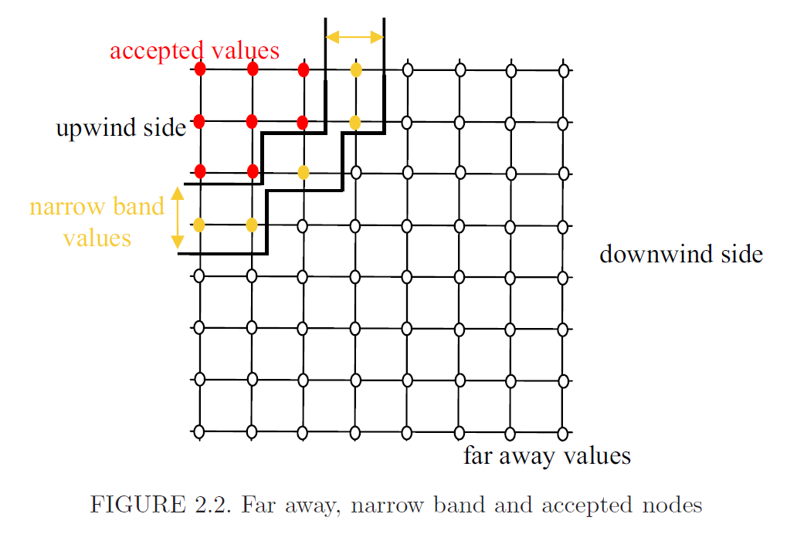

# Fast-Marching算法简介

参考文献：**Tugurlan, Maria Cristina. "Fast marching methods-parallel implementation and analysis." (2008).**

求解方程：

$$
F(x)|\nabla T(x)|=1,\quad x\in\Omega.
$$

初始条件为：

$$
T(x)=0,\quad x\in\Gamma.
$$

其中$\Omega$是一个区域，$\Gamma$是某条初始曲线。

## 离散化

以二维为例，采用迎风格式离散化，也就是所谓的Rouy-Tourin格式：

$$
\begin{aligned}
&\left[\max\left(\max\left(\frac{T_{i,j}-T_{i-1,j}}{\Delta x},0\right),\max\left(\frac{T_{i,j}-T_{i+1,j}}{\Delta x},0\right)\right)\right]^2
\\+&\left[\max\left(\max\left(\frac{T_{i,j}-T_{i,j-1}}{\Delta y},0\right),\max\left(\frac{T_{i,j}-T_{i,j+1}}{\Delta y},0\right)\right)\right]^2\\
=&\frac{1}{F_{i,j}^2}
\end{aligned}
$$

## 算法

算法过程类似Dijkstra，如图：

这里有一个关键点：需求解的等式仅会用到$T_{i,j}$和其所有小于$T_{i,j}$的邻居，因此像Dijkstra一样，从小到大扫描时，就可以保证所有比自己小的邻居均已扫描，故不会出现问题。
