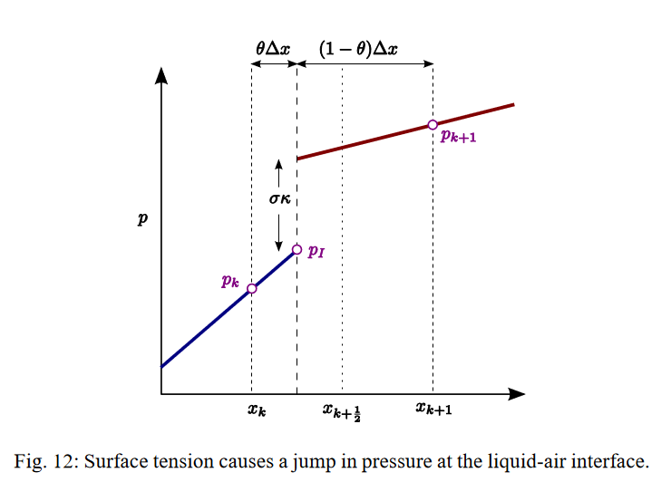
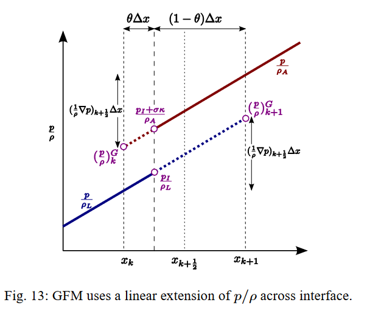

# 使用Ghost Fluid Method求解流体自由表面

本文参考：*Boyd, Landon, and Robert Bridson. "MultiFLIP for energetic two-phase fluid simulation." ACM Transactions on Graphics (TOG) 31.2 (2012): 1-12.*

在使用投影法求解无粘不可压流体时，需要求解方程$\Delta t\nabla\cdot(\frac{1}{\rho}\nabla p)=\nabla\cdot\bm{u}$. 现考虑液-气界面的情况，假设格子$x_k$是流体，格子$x_{k+1}$是气体，压强函数如图：

在$x_{k}$和$x_{k+1}$之间有一界面$x_I$，界面处的流体压强为$p_I$，界面处有压强跳变$\sigma_\kappa$.

虽然$p$有跳变，但$\frac{1}{\rho}\nabla p$连续。我们假设在同一格内，$\frac{1}{\rho}\nabla p$的值不变，那么我们可以把流体中的值延伸至假想的气体，或者把气体中的值延伸至假想的流体，称作ghost values，用$(\frac{p}{\rho})^G$表示，如图：

由于流体部分和气体部分的$\frac{1}{\rho}\nabla p$相等，我们可以列出方程

$$
\frac{1}{\rho_L}\frac{p_I-p_k}{\theta\Delta x}=\frac{1}{\rho_A}\frac{p_{k+1}-(p_I+\sigma_\kappa)}{(1-\theta)\Delta x}.
$$

其中$\rho_L$为流体密度，$\rho_A$为固体密度。整理得

$$
p_I=\frac{\rho_L(p_{k+1}-\sigma_\kappa)\theta+\rho_A p_k(1-\theta)}{\rho_L\theta+\rho_A(1-\theta)}.
$$

记

$$
\hat{\rho}=\rho_L\theta+\rho_A(1-\theta),
$$

由上述假设，在整个格子内则我们认为$\frac{1}{\rho}\nabla p$不变，即得

$$
\left(\frac{1}{\rho}\nabla p\right)_{k+\frac{1}{2}}=\frac{1}{\hat\rho}\frac{p_{k+1}-p_k-\sigma_\kappa}{\Delta x}.
$$

此外，对于格子的另一个面，$x_{k-\frac{1}{2}}$，由于其不涉及边界，我们可以直接求得

$$
\left(\frac{1}{\rho}\nabla p\right)_{k-\frac{1}{2}} = \frac{1}{\rho_L}\frac{p_k-p_{k-1}}{\Delta x}.
$$

那么，投影方程$\Delta t\nabla\cdot(\frac{1}{\rho}\nabla p)=\nabla\cdot\bm{u}$的形式转化为

$$
\frac{\Delta t}{\Delta x}\left(\frac{1}{\hat\rho}\frac{p_{k+1}-p_k-\sigma_\kappa}{\Delta x}-\frac{1}{\rho_L}\frac{p_k-p_{k-1}}{\Delta x}\right)=\nabla\cdot\bm{u}.
$$

我们可以把$\sigma_\kappa$移到等式右端，那么上式就变成

$$
\frac{\Delta t}{\hat\rho}\frac{p_{k+1}-p_k}{\Delta x^2}-\frac{\Delta t}{\rho_L}\frac{p_k-p_{k-1}}{\Delta x^2}=\nabla\cdot\bm{u}+\frac{\Delta t}{\hat{\rho}}\frac{\sigma_\kappa}{\Delta x^2}.
$$

这里的含义实际上就变成了，把面上的密度$\rho_{k+\frac{1}{2}}$改为$\hat\rho$，同时在右端新增一项$\frac{\Delta t}{\hat{\rho}}\frac{\sigma_\kappa}{\Delta x^2}$.

实际上，我们还可以注意到，上面的推导完全没有用到$x_k$是流体而$x_{k+1}$是气体这一性质。也就是说，如果$x_k$是气体而$x_{k+1}$是流体，那么结果并未改变，唯一的区别是，此时$\sigma_\kappa$的符号相反。
