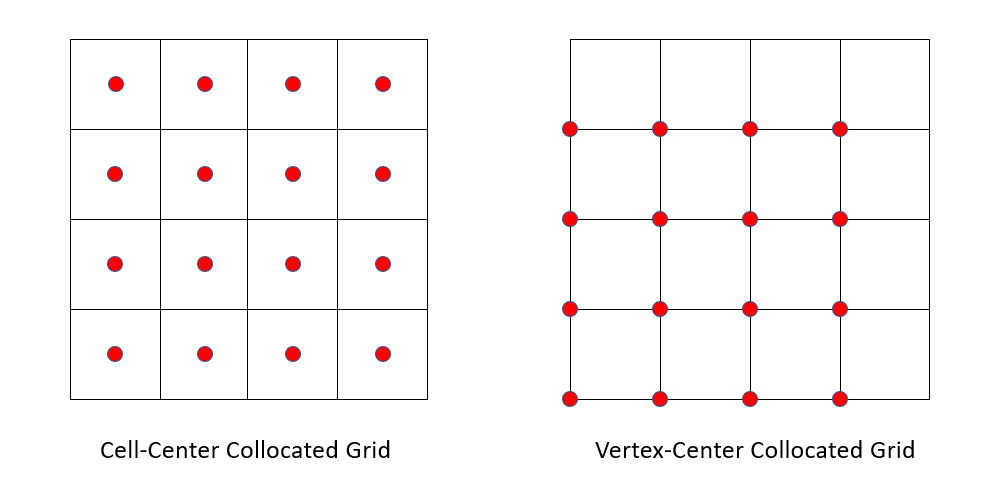

# 网格系统

我们的网格系统实现于`Grid<d>`、`Field<T,d,side>`、`FaceField<T,d,side>`三个类型。其中，`Grid<d>`并不拥有数据，是一个为方便计算起见而提取出的接口，剩下两个类型拥有数据。

# Grid类型

我们对`Grid<d>`类型的设计是：**Grid<d>本身代表且仅代表“一些晶格数据点（lattice data points）在内存中的排布”，即，与其实际物理意义没有任何关系。** 下文中我们会解释这句话。在代码和文档中，我们把这些晶格数据点称为node，下文中亦使用这一术语。

`Grid<d>`类型负责如下三种任务：

- 计算地址/下标映射、node位置、网格尺寸等基础数据。对于地址映射，我们按照SPGrid的思路，三维按$4\times 4\times 4$切块，二维按$8\times 8$切块，这样每一个块内含有64个元素，每块内的元素在内存当中相邻，这样适配CUDA的缓存大小，访存较为友好。注意，我们在创建`Grid<d>`时，会**强制padding到4或8的倍数。**
- 执行计算node邻居、提取face grid、cell grid等几何相关运算。
- 遵循编程规范中`iterator-lambda`项的要求，提供并行/串行遍历全部nodes的iterator接口。

接下来我们解释`Grid<d>`类型的设计思路。在`Meso`中，会用到两种网格，一种是`CORNER`网格，另一种是`CENTER`网格。从编程角度上来说，同样尺寸的两种网格的数据点在内存中排布完全相同。然而通过将这个相同的网格解释为`CORNER`网格或者`CENTER`网格，我们可以解释两种物理意义。即，这两种数据位置在**编程**上是相同的，它们之间的区别只是一种**解释**上的区别。例如，考虑一个$8\times 8\times 8$的`CENTER`网格，它的格子中心一共有$8^3$个数据点，而一个$8\times 8\times 8$的`CORNER`网格也有$8^3$个数据点。这两组数据点在内存中的排列顺序完全相同，进而，如果它们的$\Delta x$（也就是`Grid<d>::dx`）相同，而坐标最小的数据点（也就是`Grid<d>::pos_min`）相同，那么这两组数据点在空间中的位置亦完全相同。事实上，它们所对应的`Grid<d>`也是完全相同的。

但是在物理**解释**上，这两种情况之间存在区别。即，假设$\Delta x=1$，计算域从原点开始，那么$8^3$的`CENTER`网格将表示计算域$[0,8)^3$，其坐标最小的数据点为$(0.5,0.5,0.5)$，而$8^3$的`CORNER`网格将表示计算域 $[0,7]^3$，其坐标最小的数据点为$(0,0,0)$.

在实际应用中，**CFD**（计算流体力学）通常将collocated grid的grid point定义在cell中心，而**FEM**（有限元）通常将grid point定义在cell corner。为了区分和兼容这两大模拟需求，我们定义

```c++
enum GridType { CENTER = 0, CORNER };
```



如上图所示，同样的$4 \times 4$网格，有着两种与cell的对应关系：cell-center collocated grid（即`GridType::CENTER`）对应CFD通常使用的情况，而vertex-center collocated grid（即`GridType::CORNER`）对应FEM通常使用的情况。

并如先前所说，`Grid<d>`本身并不储存`GridType`，这个enum类型会被传给`Grid<d>`的成员函数，用来告知程序，这个`Grid<d>`应该被视为哪一种网格类型。例如，在上面的例子中，如果向`Grid<d>`的构造函数传入了`CENTER`，那么`pos_min`将被设置为$(0.5,0.5,0.5)$，否则就是$(0,0,0)$.可以发现，这个网格类型需要由`Grid<d>`之外的模拟器维护，因为它描述的是物理而非数据结构。此外，这还让程序拥有了更高的自由度：同一个`Grid<d>`对象可以轻松地在某一处被解释为`CENTER`网格，而在另一处被解释为`CORNER`网格。

此外，我们可以发现，`CENTER`网格中，某一轴向的面心数据点亦是一组晶格数据点，也就是说，这组数据点同样构成一个`Grid<d>`.在`Grid<d>`当中，我们提供生成所有cell center/face center数据点所对应`Grid<d>`的接口，即`Cell_Grid()`和`Face_Grid()`.其中，`Cell_Grid()`默认将当前网格解释成一个`CORNER`网格，而`Face_Grid()`默认将当前网格解释成一个`CENTER`网格。

例如，对于同一个`Grid<3> grid;`，其$(i,j,k)$号node的位置都应该是`grid.Position(Vector3i(i,j,k))`。需要注意的是，其中的位置的具体数值确取决于它是`CENTER`网格还是`CORNER`网格。请看如下代码：
```c++
Grid<3> cell_grid=grid.Cell_Grid();
return cell_grid.Position(Vector3i(i,j,k));
```
本段代码的含义是，将某个`grid`解释为一个`CENTER`网格的顶点网格的时候，其$(i,j,k)$号node就是某个cell center的位置。同理，将某个`grid`解释为一个`CORNER`网格的顶点网格的时候，其$(i,j,k)$号node就是某个cell corner的位置。

此外，出于提升性能考虑，我们额外提供了无需通过`Face_Grid()`显式生成一个`Grid<d>`对象也能处理面心node的接口，这是因为在不可压流体求解时，我们需要在CUDA内核函数中频繁计算面心数据的地址。

在CPX的设计中，Face_Index不同轴向所对应的编码方式不同。为简便起见，我们暂时忽略这种不同，一律grid的方式编码，此时块内按照z-y-x的顺序编码（即，改z对应的index改变量最大，y次之，x最小），这相当于CPX中的axis==d-1的方式编码，即二维的axis=1，三维的axis=2。若今后想要重新恢复这种编码方式的区分，可以通过给Grid类再加一个模板参数的方法实现。

# Field和FaceField

利用上述的`Face_Grid()`，可以迅速把`FaceField`某一轴向上的数据解释成一个`Field`，也就是`Face_Reference()`函数。

我们保证，FaceField中每个轴向数据的储存顺序严格等同于`Grid<d>::Face_Grid()`返回的储存顺序。

Field和FaceField均按照“std::vector”的直觉设计，即所有的默认拷贝都是深拷贝，这样让用户不必操心未初始化指针的问题，可以放心复制。但实际上，其中的数据以std::shared_ptr形式存储，如此设计的原因是，可以临时地把FaceField在某个轴向上的数据取出，作为一个Field，执行Field专有的操作。
