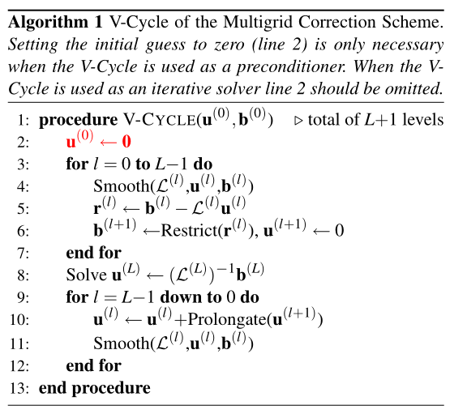
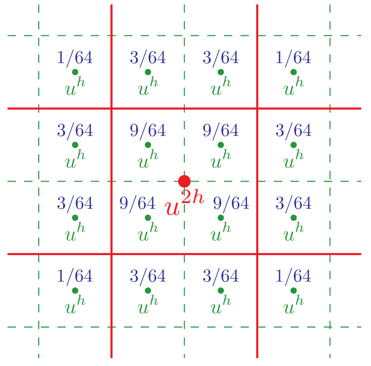
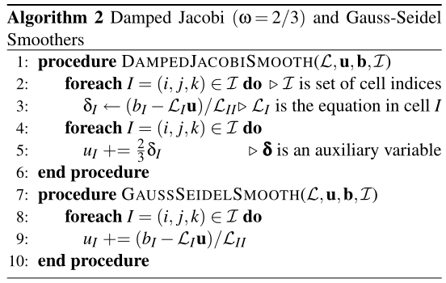

## 一、多重网格(Multigrid)法

我们采用多重网格法（Multigrid）作为共轭梯度的预处理器（Preconditioner）。多重网格法的方案参考这篇文献：*McAdams, Aleka, Eftychios Sifakis, and Joseph Teran. "A Parallel Multigrid Poisson Solver for Fluids Simulation on Large Grids." Symposium on Computer Animation. 2010.*

采用一种较为简单的V-Cycle，整体算法如下图：

这里的$\mathcal{L}^{(0)}$就是最初要求解的矩阵，也就是$\bm{Au}=\bm{b}$里面的$\bm{A}$，而$\mathcal{L}^{(1)},\mathcal{L}^{(2)}...$是从$\mathcal{L}^{(0)}$开始，逐级粗化（Coarsen）而来的。

整个算法里最重要的就是四个操作：粗化（Coarsening）、限制（Restriction）、延拓（Prolongation）、平滑（Smoothing），接下来逐一介绍这四个算子。

### 网格粗化(Coarsening)

采用较深的网格，最粗糙一层为$8\times8\times8$.

文献中对格子的分类为：
- Dirichlet cell —— 空气格
- Interior cell —— 流体格
- Neumann cell —— 边界条件格（例如流体内部的障碍物和流体外层的一圈边界条件）

我们统一采用后一种称呼，为避免和我们的术语混淆。

如果一个粗糙格在上一层中所对应的8个精细网格中有至少一个空气格，那么这个粗糙格子被标为空气格。如果没有空气格，而且有至少一个流体格，则这个粗糙格子被标为流体格。否则，它就是一个边界条件格。也就是说，优先级为空气>流体>边界条件。

但在我们的设计中，只有`FieldDv<bool, d> fixed;`标记格子状态，其元素为`true`代表流体格（即存在于方程当中），元素为`false`代表空气/边界条件格（即不存在于方程当中）。我们令其优先级为`true`>`false`.

### 限制(Restriction)和延拓(Prolongation)算子

限制算子是从细网格到粗网格，延拓算子是从粗网格到细网格。

限制算子定义为$\mathcal{R}=\mathcal{B}\otimes\mathcal{B}\otimes\mathcal{B}$，其中$\mathcal{B}$是一维的四点算子：

$$u^{2h}(x)=(\mathcal{B}u^h)(x)=\frac{1}{8}u^h(x-3h/2)+\frac{3}{8}(x-h/2)+\frac{3}{8}u^h(x+h/2)+\frac{1}{8}u^h(x+3h/2)$$

这样，一维取4个点，二维取16个点，三维取64个点，边界外的值一律视为0。二维的情况如下图：
 

延拓算子$\mathcal{P}$的严格定义为$\mathcal{P}^T=8\mathcal{B}\otimes\mathcal{B}\otimes\mathcal{B}$。实际上很简单，细网格上的每一个值就是在粗糙网格上做三线性插值，可以证明二者相等。

一般要求Restrictor和Prolongator互为转置，且要求$\mathcal{R}\circ\mathcal{P}=I$.

### 平滑(Smoothing)算子

平滑算子为阻尼雅可比法（Dampled Jacobi），其中阻尼常数$\omega=2/3$.值得指出的是，在边界条件和边界形状比较复杂的情况下，人们通常会在边界附近做额外的平滑操作。这里我们对空气/边界格附近一定距离内（曼哈顿距离）的流体格子，做若干次Gauss-Seidel迭代。

完整的平滑过程是：先在边界附近做$M$次Gauss-Seidel，然后对整个区域做一次阻尼雅可比迭代，然后再在边界附近做$N$次Gauss-Seidel。

阻尼雅可比迭代和Gauss-Seidel的算法如图：

注意，这个图里面写的不太明显，其中$u_I$始终是同一个数组。实际上这里表示了雅可比和Gauss-Seidel的最大区别：雅可比迭代中的$\bm{u}$（方程组的解，也就是一般说的$\bm{x}$），始终使用的是上一个迭代的值，而Gauss-Seidel会使用本次迭代刚刚计算出来的新值。因此Gauss-Seidel难以并行，但计算边界区域本来就需要用串行的BFS，所以也就用了串行的Gauss-Seidel。

### 缺陷
这里采用的是简单的V-Cycle，所以有一些问题需要注意。文献中强调，如果想只用多重网格法解方程，则需要在边界附近至少3格宽的区域内做30\~40次Gauss-Seidel迭代（雅可比前后各15\~20次），否则V-Cycle会震荡或发散。

此外，在某些不规则区域上，残差的下降速度会劣化到接近1，这一点在流体模拟中没有什么特别好的办法，但反正多重网格只是一个预处理器，剩下部分都由共轭梯度完成。

###实现优化

**边界处理**

对于某个格子$I^{(l)}$，如果它更粗一层的延拓stencil（也就是用于计算延拓算子的更粗一层的相邻格，二维有9个，三维有27个）中，某个格子的8个子精细格中有至少一个非流体格，就认为它靠近边界，做额外的Gauss-Seidel。这样，边界区域的判断宽度从1到3不等。这里强调一点，延拓stencil的格子都是比这个$I^{(l)}$粗一层的，它们的子精细格和$I^{(l)}$同层。文献中称这样边界宽度为1\~3，但我感觉不对，考虑最极限的对角情况，最大似乎可以到4.

此外，在V-Cycle的前半部分（从细到粗），只在雅可比迭代之后做Gauss-Seidel，在后半部分（从粗到细），只在雅可比迭代之前做Gauss-Seidel。这个次数是平衡多重网格和共轭梯度耗时得来的。而Gauss-Seidel的迭代次数和层数相关：最细一层做$2$次，之后每次加粗，迭代数都乘2（因为需要迭代的格子数变成了原来的1/4），也就是说第$l$层迭代$2^{l+1}$次。

**零猜测**

多重网格法可以看作一个关于$\bm{b}$的线性算子，即$\bm{u}=\mathcal{M}^{-1}\bm{b}$，这里$\mathcal{M}^{-1}$就是多重网格求解器，之所以写成$\mathcal{M}^{-1}$是出于和共轭梯度法描述一致的考虑。而可以发现，我们总是采用零初始解，具体来说，就是V-Cycle的第4步中，$\bm{u}^{(l)}$的初始猜测永远是零，因此这个步骤可以简化，文献称这是V-Cycle最耗时的部分。具体来说，就是把阻尼雅可比迭代写成一个关于$\bm{b}$的确定形式。但这在边界附近无效，需要判断。此外，边界附近的Gauss-Seidel会让上一步中算出的，边界带旁边格子的残差失效，这个需要在Gauss-Seidel之后额外做一步。

注：我们的代码从一开始支持vol，所以似乎不一定支持这种方案，姑且存之。

**红黑分块**
用大小为$4\times 4\times 4$的区域做红黑分块，并行Gauss-Seidel。

## 二、预条件共轭梯度法

### 标准PCG公式1
https://flat2010.github.io/2018/10/26/%E5%85%B1%E8%BD%AD%E6%A2%AF%E5%BA%A6%E6%B3%95%E9%80%9A%E4%BF%97%E8%AE%B2%E4%B9%89/#12-%E9%A2%84%E5%A4%84%E7%90%86
$$
\begin{align}
  r_0&=b-Ax_0\\
  p_0&=M^{-1}r_0\\
  \alpha_k&=\frac{r_k^T M^{-1}r_k}{p_k^T A p_k}\\
  x_{k+1}&=x_k+\alpha_k p_k\\
  r_{k+1}&=r_k-\alpha_k A p_k\\
  \beta_{k+1}&=\frac{r_{k+1}^T M^{-1}r_{k+1}}{r_k^T M^{-1}r_k}\\
  p_{k+1}&=M^{-1}r_{k+1}+\beta_{k+1} p_k
\end{align}
$$

这个$M^{-1}$就是我们的预处理器。注意这个公式里面频繁出现了$M^{-1}r$，在写算法的时候频繁这么做是不经济的。我们记$M^{-1}r_i=z_i$，则公式转变为：

$$
\begin{align}
  r_0&=b-Ax_0\\
  p_0&=z_0=M^{-1}r_0\\
  \alpha_k&=\frac{r_k^T z_k}{p_k^T A p_k}\\
  x_{k+1}&=x_k+\alpha_k p_k\\
  r_{k+1}&=r_k-\alpha_k A p_k\\
  z_{k+1}&=M^{-1}r_{k+1}\\
  \beta_{k+1}&=\frac{r_{k+1}^T z_{k+1}}{r_k^T z_k}\\
  p_{k+1}&=z_{k+1}+\beta_{k+1} p_k
\end{align}
$$

这里补充一句，如果没有preconditioning，那么直接令$M=I$为单位阵就行了。

### 标准PCG公式2：
https://zhuanlan.zhihu.com/p/98642663
这个和上面那个公式的最大区别是，它取的残差是$Ax-b$而不是$b-Ax$.因此，这个式子里面的$r$和$z$和上面式子里面的$r$和$z$刚好差一个负号。但注意，由于$r$和$z$都差了一个负号，所以$\alpha$反而是相同的，二者的$x$和$p$的含义也一样。两个式子里面$\beta$是反的，我怀疑是打错了。
$$
\begin{align}
  r_0&=Ax_0-b\\
  z_0&=M^{-1}r_0\\
  p_0&=-z_0\\
  \alpha_k&=\frac{r_k^T z_k}{p_k^T A p_k}\\
  x_{k+1}&=x_k+\alpha_k p_k\\
  r_{k+1}&=r_k+\alpha_k A p_k\\
  z_{k+1}&=M^{-1}r_{k+1}\\
  \beta_{k+1}&=-\frac{r_{k+1}^T z_{k+1}}{r_k^T z_k}\\
  p_{k+1}&=-z_{k+1}+\beta_{k+1} p_k
\end{align}
$$

### 标准PCG公式1.1
所以我们还是采用公式1里面的形式。注意到$r^Tz$项也经常出现，计算这一项是一个点积，也比较麻烦，故新增一个变量$\gamma_i=r_i^T z_i$，则进一步改写成

$$
\begin{align}
  r_0&=b-Ax_0\\
  p_0&=z_0=M^{-1}r_0\\
  \gamma_0&=r_0^T z_0\\
  \alpha_k&=\frac{\gamma_k}{p_k^T A p_k}\\
  x_{k+1}&=x_k+\alpha_k p_k\\
  r_{k+1}&=r_k-\alpha_k A p_k\\
  z_{k+1}&=M^{-1}r_{k+1}\\
  \gamma_{k+1}&=r_{k+1}^T z_{k+1}\\
  \beta_{k+1}&=\frac{\gamma_{k+1}}{\gamma_k}\\
  p_{k+1}&=z_{k+1}+\beta_{k+1} p_k
\end{align}
$$

### Eigen使用的PCG公式

https://eigen.tuxfamily.org/dox/ConjugateGradient_8h_source.html

$$
\begin{align}
  r_0&=b-Ax_0\\
  p_0&=z_0=M^{-1}r_0\\
  \gamma_0&=r_0^T p_0 (=r_0^T z_0)\\
  Ap_k&=A\cdot p_k\\
  \alpha_k&=\frac{\gamma_k}{p_k^T A p_k}\\
  x_{k+1}&=x_k+\alpha_k p_k\\
  r_{k+1}&=r_k-\alpha_k A p_k\\
  z_{k+1}&=M^{-1}r_{k+1}\\
  \gamma_{k+1}&=r_{k+1}^T z_{k+1}\\
  \beta_{k+1}&=\frac{\gamma_{k+1}}{\gamma_k}\\
  p_{k+1}&=z_{k+1}+\beta_{k+1} p_k
\end{align}
$$

其终止判据有三个：第一是如果$|b|=0$则设$x=0$退出。设阈值$\eta=(\epsilon|b|)^2$，第二个判据是如果$|r_0|^2<\eta$则退出。注意如果不这么做，当初始猜测很准使得$|r_0|\approx 0$的时候，算$\alpha_0$会得到`nan`。第三个判据是在得到$r_{k+1}$之后，如果$|r_{k+1}|^2<\eta$则退出。

其中$A$叫做`mat`，$b$叫做`rhs`，$r$叫做`residual`，$\eta$叫做`threshold`，$Ap$叫做`tmp`，$\gamma$叫做`absNew`.

### 我们使用的PCG公式

这里采用零向量作为初始猜测。

$$
\begin{align}
  r_0&=b\\
  x_0&=0\\
  z_0&=M^{-1}r_0\\
  p_0&=z_0\\
  \gamma_0&=r_0^T z_0\\
  Ap_k&=A\cdot p_k\\
  \alpha_k&=\frac{\gamma_k}{p_k^T A p_k}\\
  x_{k+1}&=x_k+\alpha_k p_k\\
  r_{k+1}&=r_k-\alpha_k A p_k\\
  z_{k+1}&=M^{-1}r_{k+1}\\
  \gamma_{k+1}&=r_{k+1}^T z_{k+1}\\
  \beta_{k+1}&=\frac{\gamma_{k+1}}{\gamma_k}\\
  p_{k+1}&=z_{k+1}+\beta_{k+1} p_k
\end{align}
$$

## 文档作者
王梦迪
