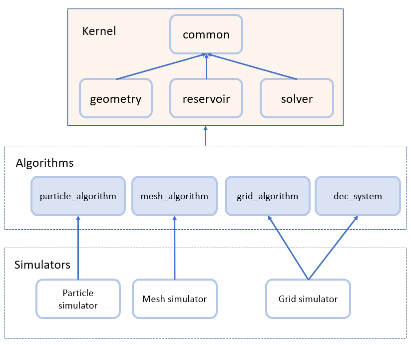

# 编程规范

建议没事就跑一遍所有测试：

    $ python run_tests.py

## 编程风格基础约定

**标识符命名规则**

- 类用首字母大写，无下划线，如`FaceField`.
- 函数用首字母大写+下划线，如`Face_Center()`.
- enum关键字全大写，但enum类型名应当遵循类的命名规则，如`DataHolder DEVICE`.
- 一个类的初始化方法只能是以下三种之一：构造函数、重载`=`运算符、一个叫`Init()`的函数。此外，每个类都应当有一个默认构造函数。

**模板命名规则**

- C++内建数据类型（如int、float、double）、Eigen当中有数学含义的基本数据类型（如四元数、复数）、Eigen中确定维数且维数较小的向量、矩阵（例如Vector2i, Matrix3），被视为Meso的内建数据类型，在模板编程中可以用`T`指代。例`T ArrayFunc::Abs_Mean(const Array<T>& v)`。
- 数组类型（`Array`和`ArrayDv`，即`thrust::host_vector`和`thrust::device_vector`）在模板编程中用`Array`指代。例`void ArrayFunc::Multiply(Array1& a, const Array2 &b)`，这个声明提示开发者传入的是某种thrust数组。
- 函数用`Func`指示。可以通过拼接关键字的方法提示函数的输入输出。例`void AuxFunc::Binary_Transform(const Array1& a, const Array2& b, TTFuncT func, Array3& c)`，此处`TTFuncT`提示参数`func`是一个形如`T f(T a, T b)`这样的函数对象。
- 在网格系统当中，`I`指示数组下标（也就是一个int），`C`指示一个节点在网格中的坐标标号（也就是一个`VectorDi`）。这里的`C`来自cell，但其实它的正式术语是Node，但用`N`容易造成混淆。例：`void FaceField::Calc_Faces(ICFuncT f)`，这里的`ICFuncT`提示参数f是形如`T f(int axis, const VectorDi face)`这样的函数对象。
- Mesh类型在模板中用`MeshType`来指代。

**编程风格约定**

- 原则上任何可以测试的代码都应该写一个测试，例如`_tests_reservoir`和`_tests_solver_dec`中的那样。测试应该有一个确定的“通过/不通过”标准（设想ACM竞赛当中的Accepted/Wrong Answer），通过用`Pass()`函数输出，失败用`Error()`函数输出，**不应依赖用户的主观判断** （例如，不应让用户肉眼检查两个数组是否相等，而应该用`ArrayFunc::Is_Approx`接口）。
- 代码库中所有内容均位于`namespace Meso`下。
- 一律采用`#pragma once`，不再使用`SimpleX`的macro guard方案。
- 目前暂时将代码库设计为header-only，**不在`.cpp`或`.cu`中实例化模板类** ，因当前阶段整个代码库仍然会频繁变动，这么做可以降低编译开销。后续做法再行讨论。
- 各种主要的类均应放在一个名称与之相同或一致的`.h`当中。例如`Grid.h`实现`Grid`类，`PoissonMapping.h`实现`MaskedPoissonMapping`类。上述的外包函数应当放在某个`xxxFunc.h`中，例如`AuxFunc.h`，`PoissonFunc.h`.此时，应创建一个包含这种外包函数的namespace，例如`namespace IOFunc`，这样可以让代码更加清晰.

## 结构设计规范

如上图所示，项目分为三层：`Kernel`，`Algorithm`和`Simulators`.

#### Kernel

此层是MESO的核心代码，拥有四个子目录：`common`、`geometry`、`reservoir`、`solver`。任何MESO的用户都会同时使用这四个子目录中的代码内容，也就是说此层可以视作一个整体，在图中用染色的实心方框表示。

其中，`common`负责最基本的程序功能，例如对`Eigen`、`Json`、`thrust`的适配、对数学常数的定义等等。`geometry`含有以各种解析方法表示的几何形体，`reservoir`含有粒子/网格/Mesh三种处理大批量数据的数据结构，`solver`是数学上的线性方程组求解器。

#### Algorithm

此层是不同类型的模拟系统需要使用的特有算法，拥有四个子目录：`particle_algorithm`、`mesh_algorithm`、`grid_algorithm`、`dec_system`。这一层并不是一个整体，因为用户可以只使用其中的若干个，在图中用虚线方框表示。

其中，前三个目录分别存放粒子系统、Mesh系统、网格系统的相关算法，最后一个目录是我们特有的外微分系统。

#### Simulators

此层是不同的模拟程序，例如Fluid Euler、SPH、FEM等等。每个程序将按需使用Algorithms层中的一个或多个子目录，同时也自动使用整个Kernel.

#### 功能分层标准

当实现一个功能的时候，我们需要考虑将这个功能放在哪一层。

Simulator层和Algorithm层的分界标准为：
- **一个完整的模拟算法应当位于Simulator层。**
- **模拟算法的成熟模块应当位于Algorithm层。**

例如，使用投影法求解理想不可压流体是一个完整的算法，因此它属于Simulator层（`fluid_euler`项目）。但其中的半拉格朗日对流格式是一个成熟的算法模块，因此它位于`grid_physics`下。投影法需要用到的泊松映射`MaskedPoissonMapping`也是一个成熟的算法模块，位于`dec_system`下。

Algorithm和Kernel层的分界标准为：
- **最小公共约定原则。** 即，Kernel层应当完整拥有Algorithm和Simulator层所需的全部公共约定，而在满足这一条件的基础上，Kernel层的内容应当尽可能少。
- **无法分类原则。** 即，如果一个功能明确不属于粒子、网格、Mesh当中的任意一种，那么它很可能应当位于Kernel层。

例如，`Grid`和`Field`类约定了MESO中全部网格数据的储存顺序，`Points`类约定了MESO中全部粒子系统的储存格式和数据结构，因此它们属于Kernel层的`reservoir`。但`LevelSet`并不向外提供公共约定，它只是一个以`Field`为基础的算法模块，因此应当位于Algorithm层，同理`PointsCreator.h`也属于Algorithm层。

再例如，`SparseMatrixMapping`和`ConjugateGradient`类并不明显属于粒子/网格/Mesh算法之一，事实上任何模拟算法都可能用它们解线性方程组，因此它们位于Kernel层的`solver`。但`Multigrid`类（目前）仅对网格系统生效，因此它位于Algorithm层的`dec_system`.

这里特别注意，如果我们将`reservoir`的内容下放至Algorithm层，则`IOFunc.h`提供的接口就无法被放在一起，或只能依赖Algorithm层的所有模块，从而违背了模块分离的原则，故`reservoir`是Kernel的一部分。但此时，`IOFunc.h`中的`VTKFunc::Write_VTS()`需要依赖插值函数，因此我们只能将`Interpolation.h`置于`reservoir`中，这是一个设计上的妥协，今后或可改正。

## 功能实现规范

- **原则上禁止使用宏实现功能**，若有绝对设计必要可例外，例如`Points.h`当中，为了实现一行命令定义和注册变量，不得不用了宏，但仅用了一处。现代C++的模板功能极其强大，绝大多数棘手的编程问题都可以用恰当的模板编程解决。
- **不鼓励特化模板类**。例如，若某一函数在`d==2`和`d==3`时表现不同，推荐的做法是在类似`if constexpr (d==2)`当中区分两种实现，而不是定义这个函数对`d==2`和`d==3`的两种特化模板。
- **一切默认行为均为深拷贝**，仅在完全明确的情况下提供无歧义的浅拷贝接口。
- **对于通过引用传递返回值的函数**，把返回值放在参数列表的开头。例如`LinearMapping<T>::Apply(ArrayDv<T>& Ap, const ArrayDv<T>& p)`，其中`Ap`为返回值。
- **代码中原则上不出现裸指针（例如`int *`），亦不鼓励出现智能指针（`std::shared_ptr`）** ，除少数特殊情况（如内核函数传数组，`DampedJacobiSmoother<T>`类里面的`LinearMapping<T>*`）。一般禁止手动管理内存（malloc/free或new/delete）。特别地，Grid被专门设计为可以通过值拷贝传入内核函数，因此鼓励向内核函数里传入`const Grid<d>`，搭配一个`const T*`就相当于传入了一个`FieldDv<T,d>`的全部数据。
- 我们鼓励采用“**基础裸接口+适配器**”的方法实现功能。这样做的好处是(A)裸接口唯一，不容易出错，(B)同时兼顾了裸接口的可扩展性和适配器的便利性，，(C)促使开发者在实现某个接口时思考其最小实现，而非默认一切都是可用的。例如`Advection.h`当中，`Semi_Lagrangian_Cell()`函数实现主要功能，`SemiLagrangian`类作为适配器，负责给这个函数装订参数。
- 函数和类的区分标准：如果一个功能可能是若干与之并列的姐妹功能当中的一种，可能会被模块化替换（注：只需要认为有可能，当前代码中不需要存在），则**优先将其设计为一个类** 。例如`SemiLagrangian`应当是一个类，因为虽然它只有静态成员函数，但可以预想到，将来可能会存在与之并列的多种对流格式，这样写成类的方式，便于用模板的方法进行传输。而如果这个功能独特到不可能有与之并列的姐妹功能，则**优先将其设计为一个“外包函数”** （例如，`GridEulerFunc.h`里面的功能均为函数，以及`Marching_Cubes`为一个函数）。
- 在上一条的基础上，我们**鼓励用外包函数**的方法实现非核心功能。这样做的好处包括：(A)减轻各个类的自身负担，(B)便于理顺依赖关系。例如`IOFunc.h`当中实现了`FaceField`的输出功能，因为它依赖`Interpolation`，但`Interpolation`又依赖`FaceField`，因此若将输出功能至于`FaceField`中就会产生循环依赖。注意在这个关系当中，外包函数严格位于它所服务的类的下游，而不是反之。
- 应**尽量减少对类成员的穿透访问**，但也不必过分拘泥。

